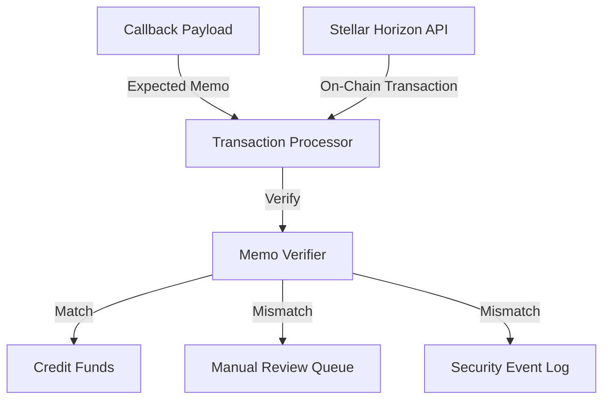
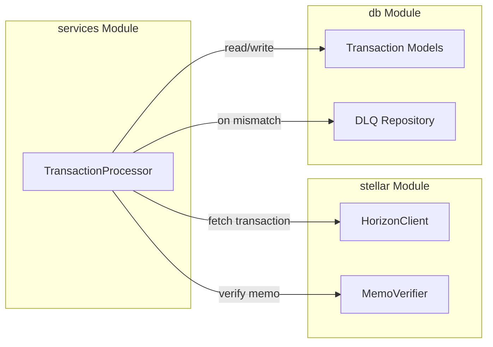

# Design Document: Stellar Memo Verification

## Overview

This design implements memo verification for Stellar blockchain transactions to prevent memo substitution attacks in a Rust-based payment processing system. The feature adds a dedicated memo verification module that compares on-chain transaction memos with expected values from callback payloads before crediting funds to user accounts.

The design introduces a new `memo` module within the existing `stellar` package that provides parsing, normalization, and verification capabilities for all three Stellar memo types (text, id, hash). This module integrates into the existing `TransactionProcessor` workflow, adding a verification gate before transaction completion.

Key design principles:
- Fail-safe: Reject transactions on memo mismatch rather than risk incorrect crediting
- Comprehensive logging: Maintain detailed audit trail for security analysis
- Type-safe: Leverage Rust's type system to prevent encoding errors
- Testable: Design for property-based testing of verification logic

## Architecture

### System Context



The memo verification system sits between transaction retrieval and fund crediting. When the Transaction Processor receives a callback with an expected memo, it fetches the corresponding on-chain transaction from Horizon and invokes the Memo Verifier to compare the two values. Only on successful verification does processing continue.

### Component Architecture



The design adds a new `memo.rs` file to the `stellar` module containing the `MemoVerifier` component. The existing `TransactionProcessor` is enhanced to call memo verification during the `try_process` method, before updating transaction status to completed.

## Components and Interfaces

### MemoVerifier Component

The `MemoVerifier` provides the core verification logic through a stateless, pure function interface.

**Location:** `src/stellar/memo.rs`

**Public Interface:**

```rust
pub enum MemoType {
    Text,
    Id,
    Hash,
}

pub enum MemoValue {
    Text(String),
    Id(u64),
    Hash([u8; 32]),
    None,
}

pub struct MemoVerifier;

impl MemoVerifier {
    /// Verifies that on-chain memo matches expected memo
    /// 
    /// # Arguments
    /// * `on_chain` - Memo value from Stellar transaction
    /// * `expected` - Memo value from callback payload
    /// 
    /// # Returns
    /// * `Ok(())` if memos match
    /// * `Err(MemoMismatchError)` if memos don't match
    pub fn verify_memo(
        on_chain: &MemoValue,
        expected: &MemoValue,
    ) -> Result<(), MemoMismatchError>;
    
    /// Parses memo from string representation
    pub fn parse_memo(
        value: &str,
        memo_type: MemoType,
    ) -> Result<MemoValue, MemoParseError>;
    
    /// Normalizes base64 encoding for hash memos
    fn normalize_hash(hash: &[u8; 32]) -> String;
}
```

**Error Types:**

```rust
#[derive(Debug, Error)]
pub enum MemoMismatchError {
    #[error("Memo mismatch: expected {expected}, got {actual}")]
    ValueMismatch { expected: String, actual: String },
}

#[derive(Debug, Error)]
pub enum MemoParseError {
    #[error("Invalid memo format for type {memo_type}: {reason}")]
    InvalidFormat { memo_type: String, reason: String },
    
    #[error("Memo exceeds maximum length for type {memo_type}")]
    TooLong { memo_type: String },
    
    #[error("Invalid base64 encoding: {0}")]
    InvalidBase64(String),
}
```

### TransactionProcessor Integration

The existing `TransactionProcessor` is enhanced to include memo verification in the processing pipeline.

**Modified Method:**

```rust
impl TransactionProcessor {
    async fn try_process(&self, tx_id: Uuid) -> Result<(), AppError> {
        // 1. Fetch transaction from database
        let tx = self.fetch_transaction(tx_id).await?;
        
        // 2. Fetch on-chain transaction from Horizon
        let on_chain_tx = self.fetch_on_chain_transaction(&tx).await?;
        
        // 3. VERIFY MEMO (new step)
        if let Some(expected_memo) = &tx.expected_memo {
            match MemoVerifier::verify_memo(&on_chain_tx.memo, expected_memo) {
                Ok(()) => {
                    info!("Memo verification passed for transaction {}", tx_id);
                }
                Err(e) => {
                    self.handle_memo_mismatch(tx_id, &on_chain_tx.memo, expected_memo, &e).await?;
                    return Err(AppError::Validation(format!("Memo mismatch: {}", e)));
                }
            }
        }
        
        // 4. Continue with existing processing logic
        self.complete_transaction(tx_id).await?;
        
        Ok(())
    }
    
    async fn handle_memo_mismatch(
        &self,
        tx_id: Uuid,
        on_chain: &MemoValue,
        expected: &MemoValue,
        error: &MemoMismatchError,
    ) -> Result<(), AppError> {
        // Log security event
        self.log_security_event(tx_id, on_chain, expected).await?;
        
        // Move to DLQ for manual review
        self.move_to_dlq(
            tx_id,
            &format!("Memo mismatch: {}", error),
            0,
        ).await?;
        
        Ok(())
    }
}
```

### Security Event Logging

Security events are logged to a dedicated audit table for memo mismatches.

**Database Schema Addition:**

```sql
CREATE TABLE memo_security_events (
    id UUID PRIMARY KEY DEFAULT gen_random_uuid(),
    transaction_id UUID NOT NULL REFERENCES transactions(id),
    on_chain_memo TEXT NOT NULL,
    expected_memo TEXT NOT NULL,
    memo_type VARCHAR(10) NOT NULL,
    created_at TIMESTAMP WITH TIME ZONE DEFAULT NOW()
);

CREATE INDEX idx_memo_security_events_tx_id ON memo_security_events(transaction_id);
CREATE INDEX idx_memo_security_events_created_at ON memo_security_events(created_at);
```

**Logging Interface:**

```rust
impl TransactionProcessor {
    async fn log_security_event(
        &self,
        tx_id: Uuid,
        on_chain: &MemoValue,
        expected: &MemoValue,
    ) -> Result<(), AppError> {
        sqlx::query(
            r#"
            INSERT INTO memo_security_events (
                transaction_id, on_chain_memo, expected_memo, memo_type
            ) VALUES ($1, $2, $3, $4)
            "#
        )
        .bind(tx_id)
        .bind(on_chain.to_string())
        .bind(expected.to_string())
        .bind(on_chain.memo_type_str())
        .execute(&self.pool)
        .await?;
        
        warn!(
            "SECURITY: Memo mismatch for transaction {}. Expected: {}, Got: {}",
            tx_id, expected, on_chain
        );
        
        Ok(())
    }
}
```

## Data Models

### MemoValue Enum

The `MemoValue` enum represents all possible memo values in a type-safe manner:

```rust
#[derive(Debug, Clone, PartialEq, Eq)]
pub enum MemoValue {
    /// Text memo (max 28 bytes UTF-8)
    Text(String),
    
    /// ID memo (unsigned 64-bit integer)
    Id(u64),
    
    /// Hash memo (32-byte array)
    Hash([u8; 32]),
    
    /// No memo present
    None,
}

impl MemoValue {
    pub fn memo_type_str(&self) -> &'static str {
        match self {
            MemoValue::Text(_) => "text",
            MemoValue::Id(_) => "id",
            MemoValue::Hash(_) => "hash",
            MemoValue::None => "none",
        }
    }
}

impl Display for MemoValue {
    fn fmt(&self, f: &mut std::fmt::Formatter<'_>) -> std::fmt::Result {
        match self {
            MemoValue::Text(s) => write!(f, "text:{}", s),
            MemoValue::Id(id) => write!(f, "id:{}", id),
            MemoValue::Hash(h) => write!(f, "hash:{}", base64::encode(h)),
            MemoValue::None => write!(f, "none"),
        }
    }
}
```

### Transaction Model Extension

The existing `Transaction` model is extended to include expected memo information:

```rust
#[derive(Debug, FromRow, Serialize, Deserialize)]
pub struct Transaction {
    // ... existing fields ...
    pub expected_memo: Option<String>,
    pub expected_memo_type: Option<String>,
}
```

The `expected_memo` field stores the serialized memo value from the callback payload, while `expected_memo_type` indicates which Stellar memo type to use during verification.

### Horizon Transaction Response

A new struct represents the transaction data fetched from Horizon:

```rust
#[derive(Debug, Deserialize)]
pub struct HorizonTransaction {
    pub id: String,
    pub hash: String,
    pub memo: Option<String>,
    pub memo_type: Option<String>,
    // ... other fields as needed ...
}
```

## Verification Algorithm

### Core Verification Logic

The `verify_memo` function implements the comparison algorithm with type-specific handling:

```rust
impl MemoVerifier {
    pub fn verify_memo(
        on_chain: &MemoValue,
        expected: &MemoValue,
    ) -> Result<(), MemoMismatchError> {
        match (on_chain, expected) {
            // Both None - valid
            (MemoValue::None, MemoValue::None) => Ok(()),
            
            // Text comparison - direct string equality
            (MemoValue::Text(a), MemoValue::Text(b)) => {
                if a == b {
                    Ok(())
                } else {
                    Err(MemoMismatchError::ValueMismatch {
                        expected: b.clone(),
                        actual: a.clone(),
                    })
                }
            }
            
            // ID comparison - numeric equality
            (MemoValue::Id(a), MemoValue::Id(b)) => {
                if a == b {
                    Ok(())
                } else {
                    Err(MemoMismatchError::ValueMismatch {
                        expected: b.to_string(),
                        actual: a.to_string(),
                    })
                }
            }
            
            // Hash comparison - normalize then compare
            (MemoValue::Hash(a), MemoValue::Hash(b)) => {
                let normalized_a = Self::normalize_hash(a);
                let normalized_b = Self::normalize_hash(b);
                
                if normalized_a == normalized_b {
                    Ok(())
                } else {
                    Err(MemoMismatchError::ValueMismatch {
                        expected: normalized_b,
                        actual: normalized_a,
                    })
                }
            }
            
            // Type mismatch - always fail
            _ => Err(MemoMismatchError::ValueMismatch {
                expected: expected.to_string(),
                actual: on_chain.to_string(),
            }),
        }
    }
}
```

### Hash Normalization

Hash memos require special handling due to base64 encoding variations:

```rust
impl MemoVerifier {
    fn normalize_hash(hash: &[u8; 32]) -> String {
        // Use standard base64 encoding without padding
        base64::engine::general_purpose::STANDARD_NO_PAD.encode(hash)
    }
}
```

The normalization ensures that:
1. Both values are converted to the same base64 variant (standard, no padding)
2. Comparison is performed on the normalized strings
3. Encoding differences don't cause false mismatches

### Parsing Algorithm

The `parse_memo` function converts string representations to `MemoValue`:

```rust
impl MemoVerifier {
    pub fn parse_memo(
        value: &str,
        memo_type: MemoType,
    ) -> Result<MemoValue, MemoParseError> {
        if value.is_empty() {
            return Ok(MemoValue::None);
        }
        
        match memo_type {
            MemoType::Text => {
                if value.len() > 28 {
                    return Err(MemoParseError::TooLong {
                        memo_type: "text".to_string(),
                    });
                }
                Ok(MemoValue::Text(value.to_string()))
            }
            
            MemoType::Id => {
                value.parse::<u64>()
                    .map(MemoValue::Id)
                    .map_err(|e| MemoParseError::InvalidFormat {
                        memo_type: "id".to_string(),
                        reason: e.to_string(),
                    })
            }
            
            MemoType::Hash => {
                let decoded = base64::decode(value)
                    .map_err(|e| MemoParseError::InvalidBase64(e.to_string()))?;
                
                if decoded.len() != 32 {
                    return Err(MemoParseError::InvalidFormat {
                        memo_type: "hash".to_string(),
                        reason: format!("Expected 32 bytes, got {}", decoded.len()),
                    });
                }
                
                let mut hash = [0u8; 32];
                hash.copy_from_slice(&decoded);
                Ok(MemoValue::Hash(hash))
            }
        }
    }
}
```


## Correctness Properties

A property is a characteristic or behavior that should hold true across all valid executions of a system—essentially, a formal statement about what the system should do. Properties serve as the bridge between human-readable specifications and machine-verifiable correctness guarantees.

### Property 1: Memo Identity

For any memo value and memo type, verifying that memo against itself should always succeed.

**Validates: Requirements 2.1, 2.2, 2.3**

### Property 2: Hash Encoding Normalization

For any 32-byte hash value, if encoded with different base64 variants (with/without padding, different alphabets), the normalized representations should compare as equal during verification.

**Validates: Requirements 2.4, 5.4**

### Property 3: Memo Mismatch Detection

For any two distinct memo values of the same type, verification should fail with a mismatch error.

**Validates: Requirements 1.3**

### Property 4: Type Mismatch Detection

For any two memo values of different types, verification should fail with a mismatch error regardless of the underlying values.

**Validates: Requirements 1.3**

### Property 5: Security Event Completeness

For any memo mismatch event, the logged security event should contain all required fields: transaction identifier, on-chain memo value, expected memo value, memo type, and timestamp.

**Validates: Requirements 4.2, 4.3, 4.4, 4.5, 4.6**

### Property 6: Parse-Verify Round Trip

For any valid memo string and memo type, parsing the string then verifying the parsed value against the original string should succeed.

**Validates: Requirements 3.1, 3.2**

### Property 7: Empty Memo Equivalence

For any memo type, verifying an empty memo against another empty memo should succeed.

**Validates: Requirements 3.4, 5.2**

## Error Handling

### Error Categories

The design defines three categories of errors:

1. **Validation Errors** - Memo mismatches and parsing failures
   - Logged as security events
   - Transaction moved to DLQ
   - User-facing error message (sanitized)

2. **System Errors** - Database failures, Horizon API errors
   - Logged as internal errors
   - Transaction retried with exponential backoff
   - Generic error message to user

3. **Configuration Errors** - Invalid memo type specifications
   - Logged as configuration errors
   - System startup prevented
   - Admin notification

### Error Handling Strategy

**Memo Mismatch Flow:**

```rust
match MemoVerifier::verify_memo(&on_chain, &expected) {
    Ok(()) => {
        // Continue processing
    }
    Err(MemoMismatchError::ValueMismatch { expected, actual }) => {
        // 1. Log security event with full details
        log_security_event(tx_id, &actual, &expected).await?;
        
        // 2. Move to DLQ for manual review
        move_to_dlq(tx_id, "Memo mismatch", 0).await?;
        
        // 3. Return sanitized error (don't leak memo values)
        return Err(AppError::Validation(
            "Transaction memo verification failed".to_string()
        ));
    }
}
```

**Parsing Error Flow:**

```rust
match MemoVerifier::parse_memo(value, memo_type) {
    Ok(memo) => memo,
    Err(MemoParseError::InvalidFormat { memo_type, reason }) => {
        error!("Failed to parse {} memo: {}", memo_type, reason);
        return Err(AppError::BadRequest(
            format!("Invalid {} memo format", memo_type)
        ));
    }
    Err(MemoParseError::TooLong { memo_type }) => {
        error!("Memo exceeds maximum length for type {}", memo_type);
        return Err(AppError::BadRequest(
            format!("{} memo exceeds maximum length", memo_type)
        ));
    }
    Err(MemoParseError::InvalidBase64(reason)) => {
        error!("Invalid base64 encoding: {}", reason);
        return Err(AppError::BadRequest(
            "Invalid base64 encoding for hash memo".to_string()
        ));
    }
}
```

### Error Recovery

**Transient Errors:**
- Horizon API timeouts: Retry with exponential backoff (existing behavior)
- Database connection failures: Retry with exponential backoff (existing behavior)

**Permanent Errors:**
- Memo mismatches: Move to DLQ, no automatic retry
- Parse errors: Return immediately, no retry
- Type mismatches: Move to DLQ, no automatic retry

**Manual Review Process:**

Transactions in the DLQ due to memo mismatches require manual investigation:

1. Security team reviews the security event log
2. Investigates whether mismatch is due to:
   - Legitimate user error (wrong memo provided)
   - System bug (encoding issue, parsing error)
   - Attack attempt (memo substitution)
3. Takes appropriate action:
   - Correct memo and requeue transaction
   - Contact user for clarification
   - Flag account for further monitoring

## Testing Strategy

### Dual Testing Approach

This feature requires both unit tests and property-based tests for comprehensive coverage:

**Unit Tests** focus on:
- Specific examples of each memo type verification
- Integration between TransactionProcessor and MemoVerifier
- Error handling paths (mismatch, parse errors)
- Security event logging
- DLQ insertion on mismatch

**Property-Based Tests** focus on:
- Universal properties that hold for all memo values
- Comprehensive input coverage through randomization
- Edge cases (empty memos, maximum length, special characters)
- Encoding variations (base64 padding, different variants)

### Property-Based Testing Configuration

**Library:** `proptest` (Rust property-based testing library)

**Configuration:**
- Minimum 100 iterations per property test
- Each test tagged with comment referencing design property
- Tag format: `// Feature: stellar-memo-verification, Property {number}: {property_text}`

**Example Property Test Structure:**

```rust
use proptest::prelude::*;

proptest! {
    #![proptest_config(ProptestConfig::with_cases(100))]
    
    // Feature: stellar-memo-verification, Property 1: Memo Identity
    #[test]
    fn test_memo_identity(memo in any_memo_value()) {
        let result = MemoVerifier::verify_memo(&memo, &memo);
        prop_assert!(result.is_ok());
    }
    
    // Feature: stellar-memo-verification, Property 2: Hash Encoding Normalization
    #[test]
    fn test_hash_encoding_normalization(
        hash in prop::array::uniform32(any::<u8>())
    ) {
        let memo1 = MemoValue::Hash(hash);
        let memo2 = MemoValue::Hash(hash);
        
        let result = MemoVerifier::verify_memo(&memo1, &memo2);
        prop_assert!(result.is_ok());
    }
}
```

### Test Generators

Property tests require custom generators for memo values:

```rust
fn any_memo_value() -> impl Strategy<Value = MemoValue> {
    prop_oneof![
        any_text_memo(),
        any_id_memo(),
        any_hash_memo(),
        Just(MemoValue::None),
    ]
}

fn any_text_memo() -> impl Strategy<Value = MemoValue> {
    // Generate strings up to 28 bytes, including special characters
    prop::string::string_regex("[\\x20-\\x7E]{0,28}")
        .unwrap()
        .prop_map(MemoValue::Text)
}

fn any_id_memo() -> impl Strategy<Value = MemoValue> {
    any::<u64>().prop_map(MemoValue::Id)
}

fn any_hash_memo() -> impl Strategy<Value = MemoValue> {
    prop::array::uniform32(any::<u8>())
        .prop_map(MemoValue::Hash)
}
```

### Unit Test Coverage

**Core Verification Tests:**
- `test_verify_matching_text_memos()` - Text memos that match
- `test_verify_mismatched_text_memos()` - Text memos that don't match
- `test_verify_matching_id_memos()` - ID memos that match
- `test_verify_mismatched_id_memos()` - ID memos that don't match
- `test_verify_matching_hash_memos()` - Hash memos that match
- `test_verify_mismatched_hash_memos()` - Hash memos that don't match
- `test_verify_empty_memos()` - Both memos are None
- `test_verify_type_mismatch()` - Different memo types

**Parsing Tests:**
- `test_parse_text_memo()` - Valid text memo
- `test_parse_text_memo_too_long()` - Text exceeds 28 bytes
- `test_parse_id_memo()` - Valid ID memo
- `test_parse_id_memo_invalid()` - Non-numeric ID
- `test_parse_hash_memo()` - Valid base64 hash
- `test_parse_hash_memo_invalid_base64()` - Invalid base64
- `test_parse_hash_memo_wrong_length()` - Not 32 bytes
- `test_parse_empty_memo()` - Empty string

**Integration Tests:**
- `test_transaction_processing_with_matching_memo()` - Happy path
- `test_transaction_processing_with_mismatched_memo()` - Rejection path
- `test_memo_mismatch_creates_security_event()` - Logging verification
- `test_memo_mismatch_moves_to_dlq()` - DLQ insertion
- `test_transaction_processing_without_memo()` - No memo case

**Hash Normalization Tests:**
- `test_hash_normalization_with_padding()` - Different padding
- `test_hash_normalization_url_safe()` - URL-safe vs standard base64
- `test_hash_normalization_consistency()` - Same hash always normalizes same way

### Test Data

**Example Test Memos:**

```rust
// Text memos
const TEXT_MEMO_SIMPLE: &str = "user123";
const TEXT_MEMO_MAX_LENGTH: &str = "1234567890123456789012345678"; // 28 bytes
const TEXT_MEMO_SPECIAL_CHARS: &str = "user@example.com!#$%";

// ID memos
const ID_MEMO_SMALL: u64 = 123;
const ID_MEMO_LARGE: u64 = u64::MAX;

// Hash memos (base64 encoded)
const HASH_MEMO_STANDARD: &str = "AAAAAAAAAAAAAAAAAAAAAAAAAAAAAAAAAAAAAAAAAAA=";
const HASH_MEMO_NO_PADDING: &str = "AAAAAAAAAAAAAAAAAAAAAAAAAAAAAAAAAAAAAAAAAAA";
const HASH_MEMO_URL_SAFE: &str = "AAAAAAAAAAAAAAAAAAAAAAAAAAAAAAAAAAAAAAAAAAA=";
```

### Continuous Integration

All tests run on every commit:
- Unit tests: Fast feedback on basic functionality
- Property tests: Comprehensive coverage of edge cases
- Integration tests: End-to-end verification workflow

Test failure criteria:
- Any unit test failure blocks merge
- Any property test failure blocks merge
- Coverage below 80% blocks merge (for new code)
