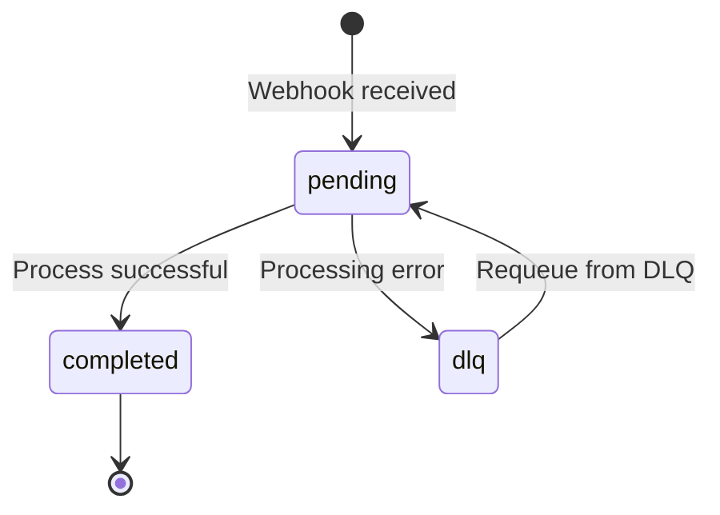

# Transaction State Machine

This document describes the transaction lifecycle and state transitions in Synapse Core.

## State Diagram



## States

### pending
**Initial state** - Transaction created and awaiting processing.

**Entry conditions:**
- Webhook received with valid payload
- Transaction requeued from DLQ

**Exit transitions:**
- → `completed`: Transaction processor successfully processes transaction
- → `dlq`: Processing error or max retry attempts exceeded

**Database field:** `status = 'pending'`

**Code references:**
- Default status in `Transaction::new()`: `src/db/models.rs`
- Set on requeue: `src/services/transaction_processor.rs:48`

---

### completed
**Terminal state** - Transaction successfully processed and verified.

**Entry conditions:**
- Transaction processor successfully completes processing

**Exit transitions:** None (terminal state)

**Database field:** `status = 'completed'`

**Code references:**
- Set by processor: `src/services/transaction_processor.rs:22`
- Force complete (admin): `src/cli.rs:83`
- GraphQL mutation: `src/graphql/resolvers/transaction.rs:84`

---

### dlq
**Dead Letter Queue state** - Transaction failed and moved to DLQ for manual review.

**Entry conditions:**
- Processing error occurred
- Max retry attempts exceeded

**Exit transitions:**
- → `pending`: Manual requeue via `requeue_dlq()` API

**Database storage:** Separate `transaction_dlq` table with reference to original transaction

**Code references:**
- Requeue function: `src/services/transaction_processor.rs:requeue_dlq()`
- DLQ table: `migrations/20260220143500_transaction_dlq.sql`

---

## Transition Triggers

### Automatic Transitions

| From | To | Trigger | Code Location |
|------|-----|---------|---------------|
| pending | completed | Successful processing | `src/services/transaction_processor.rs:process_transaction()` |
| pending | dlq | Processing error | Error handler (implicit) |

### Manual Transitions

| From | To | Trigger | Code Location |
|------|-----|---------|---------------|
| dlq | pending | Admin requeue | `src/services/transaction_processor.rs:requeue_dlq()` |
| pending | completed | Force complete (admin) | `src/cli.rs:handle_tx_force_complete()` |

---

## Error Paths

### Processing Errors
```
pending → [processing error] → dlq
```

### Recovery Paths
```
dlq → [requeue] → pending → [process] → completed
```

---

## State Persistence

States are persisted in the PostgreSQL database:

**Main table:** `transactions`
- `status` column: `'pending'` or `'completed'`
- Default value: `'pending'`

**DLQ table:** `transaction_dlq`
- Stores failed transactions with error details
- Links to original transaction via `transaction_id`
- Original transaction status remains `'pending'` in `transactions` table

---

## Monitoring

### Key Metrics
- Transactions by status: `GET /stats/status-counts`
- DLQ size: Count of records in `transaction_dlq`
- Completion rate: `completed / (completed + pending + dlq)`

### State Duration
- `pending → completed`: Target < 30 seconds
- `dlq` retention: 30 days (configurable)

---

## Code References

### State Transitions
- **Transaction Processor**: `src/services/transaction_processor.rs`
  - `process_transaction()`: pending → completed
  - `requeue_dlq()`: dlq → pending
- **Webhook Handler**: `src/handlers/webhook.rs`
  - Creates transactions in `pending` state
- **CLI Commands**: `src/cli.rs`
  - `handle_tx_force_complete()`: Force transition to completed
- **GraphQL Mutations**: `src/graphql/resolvers/transaction.rs`
  - `force_complete_transaction()`: Admin override to completed

### Database Schema
- **Transactions Table**: `migrations/20250216000000_init.sql`
  - `status VARCHAR(20) NOT NULL DEFAULT 'pending'`
- **DLQ Table**: `migrations/20260220143500_transaction_dlq.sql`
  - Stores failed transaction references

### Models
- **Transaction Model**: `src/db/models.rs`
  - Default status: `'pending'`
- **Query Functions**: `src/db/queries.rs`
  - Status-based queries and filtering
