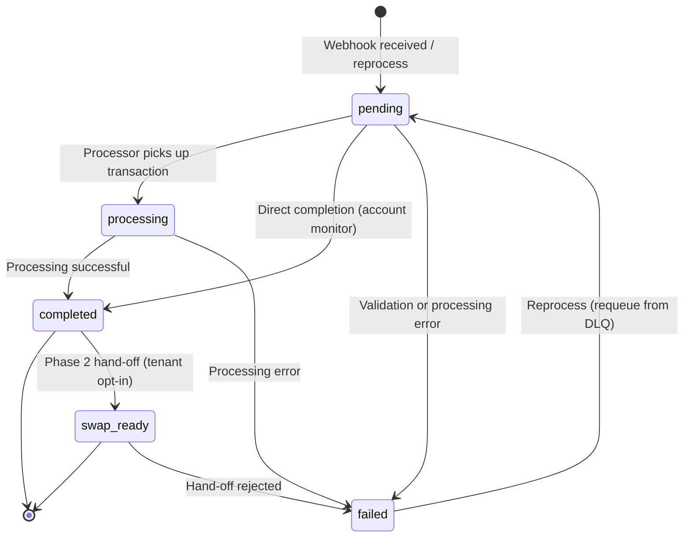

# Transaction State Machine

This document describes the transaction lifecycle and state transitions in Synapse Core.

## State Diagram


```mermaid
stateDiagram-v2
    [*] --> pending: Webhook received / reprocess

    pending --> processing: Processor picks up transaction
    pending --> completed: Direct completion (account monitor)
    pending --> failed: Validation or processing error

    processing --> completed: Processing successful
    processing --> failed: Processing error

    failed --> pending: Reprocess (requeue from DLQ)

    completed --> [*]
    completed --> swap_ready: Phase 2 hand-off (tenant opt-in)
    swap_ready --> [*]
    swap_ready --> failed: Hand-off rejected
```

## States

### pending
**Initial state** — Transaction created and awaiting processing.

**Entry conditions:**
- Webhook received with valid payload
- Transaction requeued from DLQ (`failed → pending`)

**Exit transitions:**
- → `processing`: Processor picks up the transaction
- → `completed`: Direct completion (e.g., account monitor matches payment)
- → `failed`: Validation or processing error

**Database field:** `status = 'pending'`

---

### processing
**Intermediate state** — Transaction is actively being processed.

**Entry conditions:**
- Processor picks up a `pending` transaction

**Exit transitions:**
- → `completed`: Processing pipeline succeeds
- → `failed`: Processing pipeline fails

**Database field:** `status = 'processing'`

---

### completed
**Terminal state for Phase 1** — Transaction successfully processed and verified.

**Entry conditions:**
- Processing pipeline completes successfully
- Account monitor matches an incoming payment to a pending transaction

**Exit transitions:**
- None by default (terminal)
- → `swap_ready`: only when the owning tenant has opted into Phase 2 swap (see below). No Phase 1 code performs this transition.

**Database field:** `status = 'completed'`

---

### swap_ready
**Phase 2 hand-off state** — A completed transaction whose tenant has opted into
swap, waiting for the Phase 2 swap engine to pick it up.

**Entry conditions:**
- `completed → swap_ready`, performed by a future swap-hand-off step, gated on
  `swap::swap_enabled_for(flags, tenant_id)` (the `swap_engine` feature flag,
  off by default)

**Exit transitions:**
- → `failed`: the swap engine rejected the hand-off (`SwapError`)
- terminal otherwise (Phase 2 owns the transaction from here)

**Database field:** `status = 'swap_ready'`

**Not yet wired.** Phase 1 defines the state and the hand-off contract only; no
code constructs a `swap::SwapHandoff` or calls a `swap::SwapEngine` today.

---

### failed
**Error state** — Transaction failed and may be reprocessed.

**Entry conditions:**
- Processing error occurred at any stage

**Exit transitions:**
- → `pending`: Manual requeue via `requeue_dlq()` API

**Database field:** `status = 'failed'`

---

## Transition Validation

All status updates are guarded by `validate_status_transition(from, to) -> Result<(), AppError>` in `src/validation/state_machine.rs`.

Invalid transitions return `AppError::InvalidStatusTransition` (HTTP 400, code `ERR_TRANSACTION_005`).

### Valid Transitions Table

| From        | To          | Trigger                                 |
|-------------|-------------|-----------------------------------------|
| pending     | processing  | Processor picks up transaction          |
| pending     | completed   | Account monitor direct completion       |
| pending     | failed      | Validation or processing error          |
| processing  | completed   | Processing pipeline success             |
| processing  | failed      | Processing pipeline error               |
| failed      | pending     | Admin requeue from DLQ                  |
| dlq         | pending     | Admin requeue from DLQ                  |
| completed   | swap_ready  | Phase 2 hand-off (tenant opt-in)        |
| swap_ready  | failed      | Swap engine rejected the hand-off       |

### Invalid Transitions (examples)

| From        | To          | Reason                                  |
|-------------|-------------|-----------------------------------------|
| completed   | pending     | Terminal state — cannot be reversed     |
| completed   | processing  | Terminal state — cannot be reversed     |
| completed   | failed      | Terminal state — cannot be reversed     |
| processing  | pending     | Must complete or fail, not revert       |
| failed      | processing  | Must go through pending first           |
| failed      | completed   | Must go through pending first           |

---

## Code References

### Validation Function
- `src/validation/state_machine.rs` — `validate_status_transition(from, to)`

### Status Update Sites
- `src/services/transaction_processor.rs` — `CompleteStage::execute()` (pending/processing → completed)
- `src/services/transaction_processor.rs` — `requeue_dlq()` (failed → pending)
- `src/services/account_monitor.rs` — `process_payment()` (pending → completed)

### Database Schema
- `migrations/20250216000000_init.sql` — `status VARCHAR(20) NOT NULL DEFAULT 'pending'`
- `migrations/20260220143500_transaction_dlq.sql` — DLQ table

### Phase 2 swap boundary
- `src/swap/mod.rs` — `SwapHandoff`, `SwapEngine`, `SwapOutcome`, `SwapError`, `NoopSwapEngine`, `swap_enabled_for()`

---

## Phase 2 hand-off (`swap_ready`)

This repo is Phase 1 of Synapse Bridge. `src/swap/mod.rs` defines the boundary a
future swap engine plugs into — the interface and hand-off contract only, no swap
logic.

**Data contract.** When a `completed` transaction crosses to `swap_ready`, Phase 2
receives a `swap::SwapHandoff`:

| Field | Source | Notes |
|-------|--------|-------|
| `transaction_id` | `transactions.id` | |
| `tenant_id` | resolved by caller | `Option` — the row does not carry it |
| `stellar_account` | `transactions.stellar_account` | settlement destination |
| `source_asset` | `transactions.asset_code` | the swap source asset |
| `amount` | `transactions.amount` | in `source_asset` units |
| `completed_at` | `transactions.updated_at` | at `completed` |
| `idempotency_key` | `format!("swap:{transaction_id}")` | Phase 2 dedupes retries on this |
| `metadata` | `transactions.metadata` | carried through untouched |

**Interface.** `#[async_trait] trait SwapEngine` with
`on_swap_ready(SwapHandoff) -> Result<SwapOutcome, SwapError>` and `name()`. It is
transport-agnostic — an implementation may be in-process, a separate microservice,
or an on-chain contract — and must be idempotent on `idempotency_key`.

**Opt-in.** `swap::swap_enabled_for(flags, tenant_id)` returns `false` unless the
`swap_engine` feature flag is enabled for that tenant, so transactions for tenants
and assets not opted into swap are unaffected. The default engine is
`NoopSwapEngine`, which returns `SwapOutcome::Skipped` for every hand-off.

---

## Error Handling

Invalid transitions return:

```json
{
  "error": "Invalid status transition: Cannot transition from 'completed' to 'pending'",
  "code": "ERR_TRANSACTION_005",
  "status": 400
}
```
